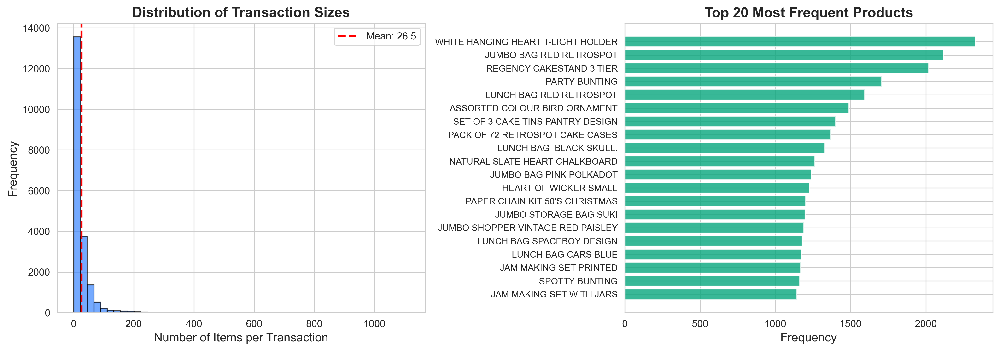
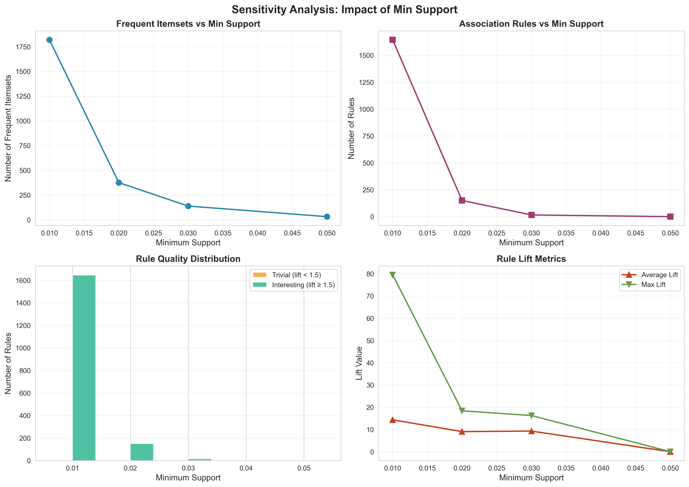
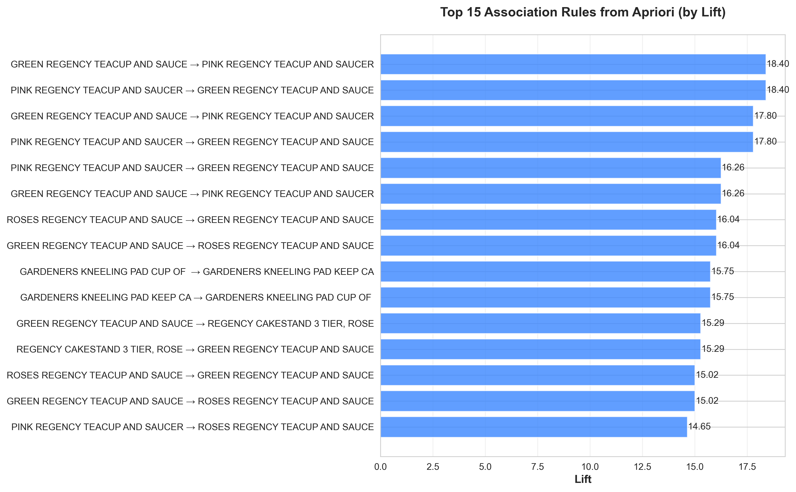
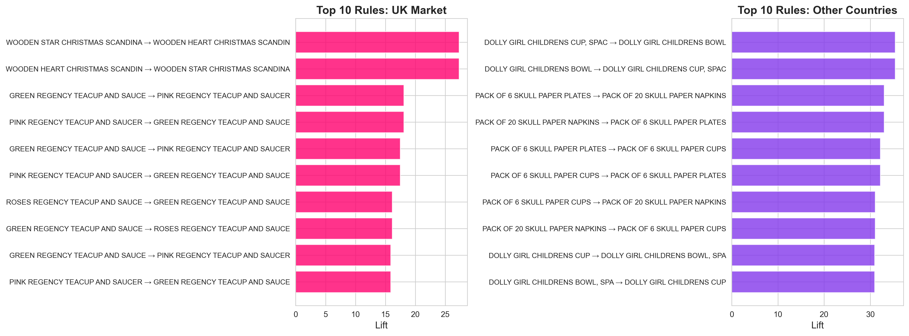

# Data Mining and Association Rule Learning Projects

A collection of data mining and market basket analysis projects implementing Apriori and FP-Growth, with analysis and visualizations.

[](https://www.python.org/)
[](LICENSE)
[](https://jupyter.org/)

---

## Table of Contents

- [Projects Overview](#projects-overview)
- [Project Structure](#project-structure)
- [Installation](#installation)
- [Usage](#usage)
- [Project Details](#project-details)
- [Technologies](#technologies)
- [Results & Visualizations](#results--visualizations)
- [Screenshots](#screenshots)
- [License](#license)

---

## Projects Overview

### **Project 1: E-Commerce Mini Project (End-to-End)**

A complete end-to-end analysis of e-commerce data with customer insights, product performance, and sales analysis.

Location: `data1/`

- **Dataset:** Clients, Products, Sales, and Reviews data
- **Notebook:** `07_mini_projet_end_to_end.ipynb`
- **Focus:** Comprehensive business intelligence and customer analytics

### **Project 2: Association Rule Mining & Comparative Analysis**

Implementation and comparison of Apriori and FP-Growth algorithms with sensitivity analysis, benchmark testing, and performance evaluation.

Location: `data2/`

- **Main Notebook:** `main.ipynb`
- **Datasets:** Order data, Transaction datasets
- **Algorithms:** Apriori, FP-Growth
- **Analysis:** Sensitivity analysis, algorithm comparison, performance benchmarking
- **Focus:** Market basket analysis and association rule mining

---

## Project Structure

```
data_mining/
│
├── data1/                                # E-Commerce Project
│   ├── 07_mini_projet_end_to_end.ipynb  # Main analysis notebook
│   └── data/                              # Dataset directory
│       ├── avis.csv                      # Customer reviews
│       ├── clients.csv                   # Customer data
│       ├── produits.csv                  # Product information
│       └── ventes.csv                    # Sales transactions
│
├── data2/                                # Association Rule Mining Project
│   ├── main.ipynb                        # Main analysis notebook
│   ├── requirements.txt                  # Python dependencies
│   ├── data/                             # Dataset directory
│   │   ├── order_data.csv               # Order information
│   │   └── transaction_dataset.csv      # Transaction records
│   ├── results/                          # Analysis results
│   └── src/                              # Python source code
│       ├── __init__.py                  # Package initialization
│       ├── analysis.py                  # Analysis functions
│       ├── apriori_fpgrowth.py          # Algorithm implementations
│       └── data_preprocessing.py        # Data cleaning & preprocessing
│
└── README.md                             # This file
```

---

## Installation

### Prerequisites

- Python 3.8 or higher
- pip (Python package installer)

### Setup Steps

1. **Clone the repository:**

   ```bash
   git clone https://github.com/yourusername/data_mining.git
   cd data_mining
   ```

2. **Create a virtual environment (recommended):**

   ```bash
   python -m venv venv

   # On Windows:
   venv\Scripts\activate

   # On macOS/Linux:
   source venv/bin/activate
   ```

3. **Install dependencies:**
   ```bash
   pip install -r data2/requirements.txt
   ```

### Dependencies

| Package    | Version | Purpose                      |
| ---------- | ------- | ---------------------------- |
| pandas     | ≥2.0.0  | Data manipulation & analysis |
| numpy      | ≥1.24.0 | Numerical computing          |
| matplotlib | ≥3.7.0  | Data visualization           |
| seaborn    | ≥0.12.0 | Statistical visualization    |
| openpyxl   | ≥3.1.0  | Excel file handling          |
| jupyter    | ≥1.0.0  | Interactive notebooks        |
| mlxtend    | ≥0.23.0 | ML extensions & metrics      |

---

## Usage

### Project 1: E-Commerce Analysis

```bash
# Navigate to project directory
cd data1/

# Open Jupyter Notebook
jupyter notebook 07_mini_projet_end_to_end.ipynb
```

**Outputs:**

- Customer segmentation analysis
- Product performance metrics
- Sales trend analysis
- Customer sentiment from reviews

### Project 2: Association Rule Mining

```bash
# Navigate to project directory
cd data2/

# Open main notebook
jupyter notebook main.ipynb
```

**Analysis Steps:**

1. Data preprocessing and cleaning
2. Frequent itemset mining (Apriori & FP-Growth)
3. Association rule generation
4. Sensitivity analysis
5. Algorithm comparison and benchmarking
6. Visualization of results

#### Key Functions

```python
# From src/apriori_fpgrowth.py
from src.apriori_fpgrowth import AprioriAlgorithm, FPGrowth

# Initialize and run Apriori
apriori = AprioriAlgorithm(min_support=0.05)
itemsets = apriori.fit(transactions)

# Generate association rules
rules = generate_association_rules(itemsets, min_confidence=0.6)
```

```python
# From src/analysis.py
from src.analysis import sensitivity_analysis, plot_algorithm_comparison

# Perform sensitivity analysis
results = sensitivity_analysis(
    transactions=data,
    support_values=[0.01, 0.05, 0.10, 0.15],
    algorithm='apriori'
)

# Compare algorithms
plot_algorithm_comparison(apriori_results, fpgrowth_results)
```

---

## Project Details

### **Data Mining Concepts Implemented**

**Frequent Itemset Mining**

- Apriori Algorithm (Breadth-First Search)
- FP-Growth (Depth-First Search with FP-Tree)
- Support & Confidence metrics

**Association Rule Generation**

- Rule extraction from frequent itemsets
- Confidence, Lift, and Leverage calculations
- Rule filtering and sorting

**Sensitivity Analysis**

- Varying support thresholds
- Performance impact analysis
- Rule discovery trends

**Comparative Analysis**

- Apriori vs FP-Growth performance
- Execution time comparison
- Memory usage analysis
- Accuracy validation

### **Datasets**

#### Data1: E-Commerce

- **Clients:** Customer demographics and information
- **Produits:** Product catalog and details
- **Ventes:** Transaction history and sales
- **Avis:** Customer reviews and ratings

#### Data2: Market Basket

- **Order Data:** Order details and information
- **Transaction Dataset:** Itemset transactions

---

## Technologies

```
Languages:          Python 3.8+
Data Analysis:      Pandas, NumPy
Visualization:      Matplotlib, Seaborn
Mining Algorithms:  Custom Apriori, Custom FP-Growth
Notebooks:          Jupyter Lab/Notebook
ML Libraries:       MLxtend, scikit-learn
Data Formats:       CSV, Excel, Pickle
```

---

## Results & Visualizations

The projects generate comprehensive visualizations including:

**Data1 (E-Commerce):**

- Customer distribution and segmentation
- Sales trends and patterns
- Product performance analysis
- Sentiment analysis from reviews
- Revenue and profit metrics

**Data2 (Association Rules):**

- Frequent itemset distribution
- Association rule networks
- Confidence vs Support scatter plots
- Algorithm performance comparison (Apriori vs FP-Growth)
- Sensitivity analysis graphs
- Execution time benchmarks
- Memory usage comparisons

All plots are saved in the `data2/results/` directory.

## Screenshots






---

## Example Output

### Association Rules Example:

```
Item A → Item B
- Support: 0.15
- Confidence: 0.75
- Lift: 2.3
- Leverage: 0.10
```

### Algorithm Comparison:

```
Support: 0.05
Apriori:
  - Execution Time: 2.34 seconds
  - Rules Found: 145
  - Memory: 52 MB

FP-Growth:
  - Execution Time: 0.45 seconds (5.2x faster)
  - Rules Found: 145
  - Memory: 38 MB
```

---
<a id="contact"></a>

## Contact

Hamza Alali - [hamza.alali.dev@gmail.com](mailto:hamza.alali.dev@gmail.com)

Connect with me:

- <a href="https://dev.to/@hamzaalali0" target="_blank"></a>
- <a href="https://www.linkedin.com/in/hamza--alali" target="_blank"></a>
- <a href="https://github.com/hamza-alali-0" target="_blank"></a>
- <a href="https://www.instagram.com/alalihamza.0/" target="_blank"></a>

Project Link: [https://github.com/Hamza-Alali-0/Apriori-Fpgrowth.git](https://github.com/Hamza-Alali-0/Apriori-Fpgrowth.git)

